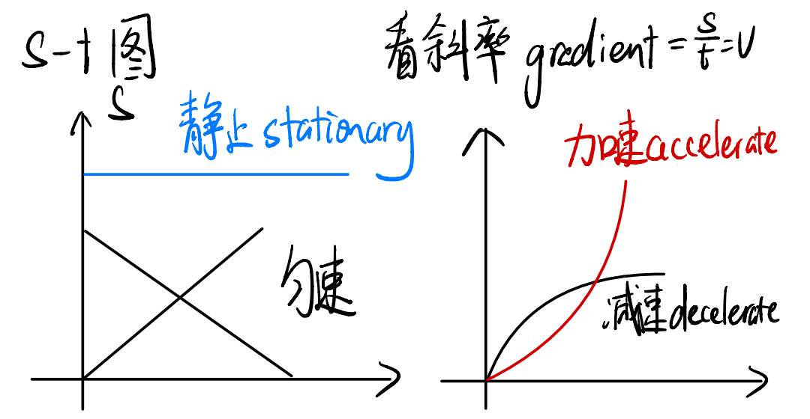
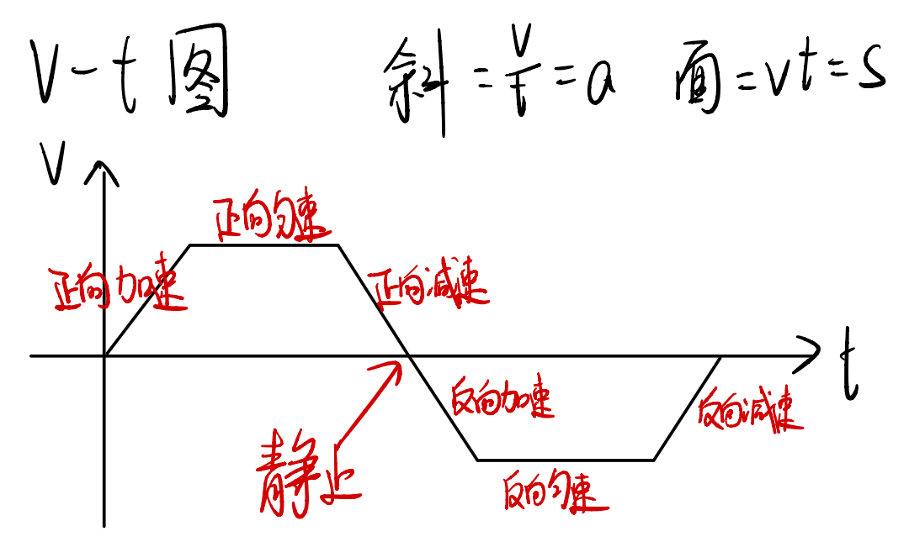
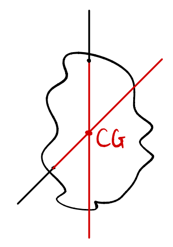
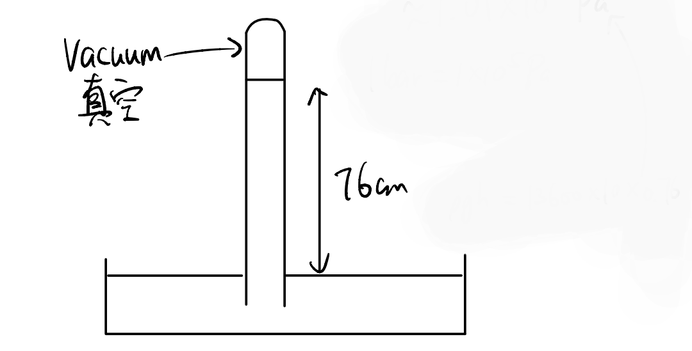

# Force
- 运动
    - 力
		- 杠杆
		- 压强
		- 能量

| Scalar标量   | Vector矢量/向量     |
| ---------- | --------------- |
| distance距离 | displacement位移  |
| speed速率    | velocity速度      |
|            | acceleration加速度 |
***formular***
- $v=\frac{s}{t}$
- $a=\frac{v}{t}$

- ***Newton's first law***:No resultant force, object will remain its state of constant velocity or stationaty.
- ***Newton's second law***:$F=ma$
- ***Newton's third law***:action and reaction
 - same magnitude
 - opposite direction

***mass vs height***

| mass     | weight                        |
| -------- | ----------------------------- |
| Scalar   | vector                        |
| kg       | N                             |
| constant | change by gravitational field |

 >$w = mg$
 >$g = 10N/kg$***(field strength)***
 >   $=10m/s^2$***(accelerantion)***

***friction opposes motion or tendancy of motion***

***Air resistance***
1. Velocity
2. Area
**free fall**
  
  

## Moment力矩(旋转)
clockwise(顺)/anti-clockwise(逆)
$M=Fd$ unit:Nm 

## Principle of moment(POM)
Equilibrium 平衡
- Translational 平移=>合力=N
- rotational 旋转=>合力矩=0Nm
>When a body is in equilibrium,the __sum of clockwise moment__ about __any pivot__ is equal to the __sum of anti-clockwise moment__ about the same pivot.
## Centre of Gravity(重心)
- suspensin悬挂
	- 物体只受拉力和重力
	- ***平衡=>重心和支点同一线***
	
	
## Stability 稳定性
- 重心越低越稳
- 底面积越大越稳

## Pressure 压强
- 固体$p=\frac{F}{A}$
- 液体/气体$p=\rho gh$
	
## 压强的应用
1. hydraulic press 液压机
2. barometer 大气压
3. manometer 气压表
	***Hydraulic press 液压机***
	
	- $P =\frac{F_小}{A_小}=\frac{F_大}{A_大}$
	- 不可以有气泡/气体，因为气体可压缩compressible
	- 液压机使用油，因为油可以润滑减小摩擦,reduce friction
	***Barometer 大气***
	
	- $1\ atm=76cmHg=760mmHg=1.01\times 10^5Pa$,$1\ bar=1\times 10^5 Pa$
	- $\rho gh=13600\times 10\times 0.76$
	***Manometer 气压表***
	- $气压差=\rho gh$
	- $P_{gas}=\rho gh+P_{atm}$
	

# Energy - Kinetic Energy $KE=\frac{1}{2}mv^2$ - Gravitational potential $GPE=mgh$ >能量可以做功，做功可以转换能量 > >你对他做1J的功， >逆消耗了1J的内能， >他获得了1J的动能。 $W=Fs=1\times 1=1J$ ## Power 功率 $P=\frac{W}{t}=\frac{E}{t}$ Weight->Work down->Watt(都是W) ## Efficiency 效率 $\frac{有用的}{全部的}\times 100\%$

<Comments/>