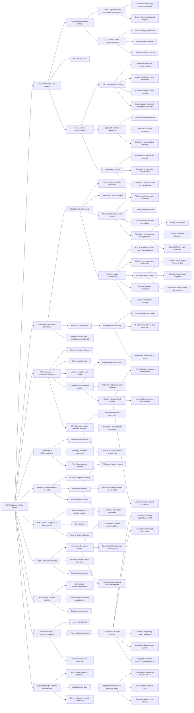

```mermaid

graph LR

A["Technology and Society Issues"]

A1["Cancel Culture & Free Speech"]
A1 --> A1a["Social media amplifies outrage"]
A1a --> A1a1["Zheng Linghua suicide case (pink-haired student)"]
A1a1 --> A1a1a["Student death wrongly blamed on teacher"]
A1a1 --> A1a1b["Online harassment caused tragedy"]
A1a --> A1a2["Liu Xuezhou online harassment case"]
A1a2 --> A1a2a["Posted missing person info"]
A1a2 --> A1a2b["Harassed after reunion"]
A1a2 --> A1a2c["Online abuse led to suicide"]
A1 --> A1b["J.K. Rowling case"]
A1 --> A1c["Free speech vs accountability"]
A1c --> A1c1["CCP censorship of June 4th"]
A1c1 --> A1c1a["Sensitive words and number blocking"]
A1c1 --> A1c1b["Avatar and display name restrictions"]
A1c1 --> A1c1c["Censorship sparks youth curiosity"]
A1c1 --> A1c1d["Banning public mourning disrespects deceased"]
A1c --> A1c2["Cultural Revolution suppression"]
A1c2 --> A1c2a["Persecution of intellectuals"]
A1c2 --> A1c2b["Mass denunciation campaigns"]
A1c2 --> A1c2c["Shadow of cancel culture in history"]
A1c --> A1c3["Limits of free speech"]
A1c3 --> A1c3a["Hate speech vs protected speech"]
A1c3 --> A1c3b["Necessity to ban racial discrimination"]
A1c3 --> A1c3c["Freedom of speech should not harm others"]

A2["Surveillance, Privacy & Data Risks"]
A2 --> A2a["TraceTogether controversy"]
A2a --> A2a1["From contact tracing to police use"]
A2a --> A2a2["Government trust damaged"]
A2a --> A2a3["China's internet real-name system"]
A2a3 --> A2a3a["All online activities require real names"]
A2a3 --> A2a3b["Chilling effect on dissent"]
A2a3 --> A2a3c["Used for censorship and surveillance"]
A2a3 --> A2a3d["Rising 'box-opening' (data leaks) problem"]
A2a3d --> A2a3d1["Privacy info exposed"]
A2a3d --> A2a3d2["Used to intimidate dissenters"]
A2a3d --> A2a3d3["Lack of effective legal protection"]
A2a --> A2a4["Five Eyes global surveillance"]
A2a4 --> A2a4a["US, UK, Australia, Canada, New Zealand alliance"]
A2a4 --> A2a4b["Massive communications interception"]
A2a4 --> A2a4c["PRISM program (NSA)"]
A2a4c --> A2a4c1["Collects Google, Apple, Facebook data"]
A2a4c --> A2a4c2["Snowden leaks secret programs"]
A2a4c --> A2a4c3["Metadata collection under anti-terrorism"]
A2a4 --> A2a4d["Edward Snowden revelations"]
A2a4 --> A2a4e["Justified by national security"]

A2 --> A2b["Trust and transparency"]
A2b --> A2b1["Google privacy washing"]
A2b1 --> A2b1a["Incognito mode still tracked"]
A2b1 --> A2b1b["$5 billion lawsuit hides data collection"]
A2b1 --> A2b1c["Misleading privacy info to users"]

A2 --> A2c["Mobile Guardian hack: 13,000 students affected"]

A3["AI & Automation – Economic Disruption"]
A3 --> A3a["Job loss: Amazon, Waymo"]
A3 --> A3b["White-collar job risks"]
A3 --> A3c["AI lacks empathy and context"]
A3 --> A3d["AI lowers costs, increases profits"]
A3d --> A3d1["Cheaper than human labor"]
A3d --> A3d2["Improves productivity, cuts expenses"]
A3d --> A3d3["Surplus value can fund citizens"]
A3d3 --> A3d3a["Fair distribution reduces work burden"]
A3d3 --> A3d3b["Universal Basic Income (UBI) potential"]
A3d3 --> A3d3c["AI helps liberate humans for freedom"]
A3 --> A3e["GPT-4o mimics human emotion and tone"]
A3e --> A3e1["Displays human-like expression"]
A3e --> A3e2["Recognizes facial cues to adjust tone"]
A3e --> A3e3["Raises bar for customer service jobs"]

A4["Technology & Dehumanisation"]
A4 --> A4a["Self-service frustrations"]
A4 --> A4b["Declining customer experience"]
A4 --> A4c["Poor design causing isolation"]

A5["AI in Education – Benefits & Risks"]
A5 --> A5a["ChatGPT supports creativity"]
A5 --> A5b["Plagiarism concerns"]
A5b --> A5b1["NTU student sorter incident"]
A5b --> A5b2["Blurred line between tools and cheating"]
A5b --> A5b3["AI detection tools often inaccurate"]
A5 --> A5c["Lacks emotional depth"]

A6["AI & Science – Progress & Responsibility"]
A6 --> A6a["AI in astrophysics & climate models"]
A6 --> A6b["Bias & ethics"]
A6 --> A6c["Need for diverse datasets"]

A7["Tech & Ethical Boundaries"]
A7 --> A7a["Deepfakes & consent issues"]
A7a --> A7a1["2020 Indian politicians used deepfakes"]
A7a --> A7a2["Taylor Swift AI nude image scandal (2024)"]
A7a --> A7a3["China's AI face-swap & voice fraud scams"]
A7 --> A7b["Influencer integrity – Daryl Yow case"]
A7 --> A7c["Standards must evolve"]

A8["Accessibility & Social Inclusion"]
A8 --> A8a["Seniors use WhatsApp/Facebook"]
A8 --> A8b["Pokémon Go accessibility adaptations"]
A8 --> A8c["Digital empathy design"]

A9["Communication & Misunderstanding"]
A9 --> A9a["Loss of tone in text"]
A9 --> A9b["Para-social relationships"]
A9b --> A9b1["Character.AI suicide incident"]
A9b1 --> A9b1a["User forms romantic dependency on AI"]
A9b1 --> A9b1b["Character.AI removed erotic chats"]
A9b1 --> A9b1c["AI stops responding causes breakdown"]
A9b1 --> A9b1d["User allegedly committed suicide"]
A9b1 --> A9b1e["Highlights emotional dangers of AI dependency"]
A9 --> A9c["Miscommunication in digital talk"]

A10["Digital Learning & Remote Engagement"]
A10 --> A10a["Zoom usage soared in pandemic"]
A10 --> A10b["Virtual learning & art"]
A10b --> A10b1["Space Opera House: AI-edited art award"]
A10b1 --> A10b1a["Created with Midjourney and Photoshop"]
A10b1 --> A10b1b["Won 2022 Colorado art prize"]
A10b1 --> A10b1c["Triggered debate on art definition"]
A10 --> A10c["Screen fatigue & reduced connection"]

A --> A1
A --> A2
A --> A3
A --> A4
A --> A5
A --> A6
A --> A7
A --> A8
A --> A9
A --> A10

```

