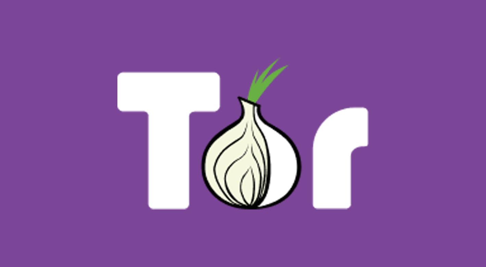
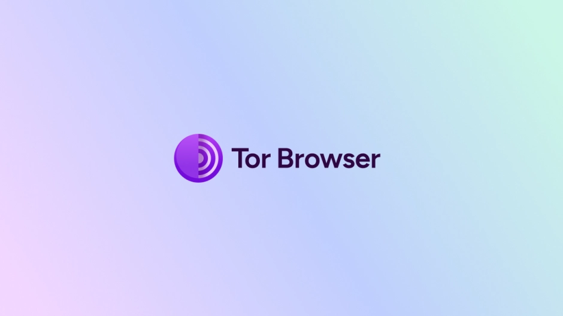
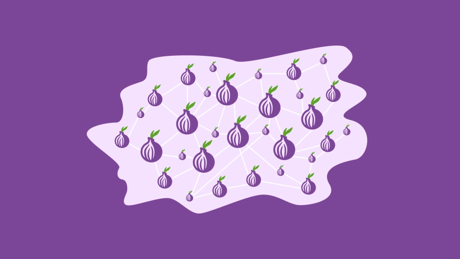

# Are there many illegal things in dark webs?

## Introduction

What's this in your mind?

A black market forllicit transactions, a breeding ground for criminal activities, or a hub for extremist content and terrorism?

This article takes you to explore the real dark web.

## Tor
### What it is
- Initially, NRL(Naval Research Laboratory) has been proposed the conception of "onion routing". It is to encrypt the data by keys and decrypt when data pass throught the node by its own key.
- In 1998, NRL publish the first prototype of tor for America goverment, military and research organisations for security communications.
- In 2002, Roger Dingleding, Nick Mathewson and other researchers was developing tor project and then published the first version of tor in 2004.
- In 2006, non-profit organisation tor project was established.
### How it works
Every domain of tor dark website must has 56 characters with suffix of `.onion`. It is differnent with the normal internet, domain was not registered by DNS. When you want to establish a new tor dark website, tor will generate a new key pair by Ed25519 algorithm. Add a prefix and version information to the public key, then hash the data with SHA-256 and encode it with Base32, resulting in a 56-character `.onion` address so each `.onion` address looked like an list of random characters not readable words but we can generate the `.onion` address which begins at readable words by "Vanity Onion Generator" and its principle is looping to generate address until it meets the requirement so if you do not have enough computing power, it will be so slowly. Every `.onion` domian are saved in the directory authority servers to offer the client which want to vist tor dark website. These directory authority servers were controlled by torproject and they are public so if these were blocked by censership, there are people cannot use tor and to counter this, Tor's anti-censership create a things which called "bridge" to allow those people to access tor connection. 

Web tunnel bridge

Our ordinary people can access Tor dark web using **Tor Browser**, it is very convenient ti use right out of the box.

Tor Browser

To access surface web in tor connection will through 3 tor nodes. The first is guard node, the second is middle node and the third is exit node. To access Tor dark web will through 6 tor nodes not directly. Each you and that website has 3 nodes. This circuit has no exit node, instead by rendezvous point. Every nodes encrypt the circuit by the TLS 1.3 certification by an algorathm of Ed25519 and exchange TLS key when the circuit begining to start. Firstly, you send a request which encrypted by the first node's public key for exchanging key to the fisrt node. Secondly, send the request which encrypted by the second node's public key for exchanging key to the second node and this has encrypt by first node's key. Thirdly, get the key of third key in same way. Encrypting the data sequentially from the last key to the first key and then the node decrypt by their key when through it until to the last node and it know which site you want to visit and it will visit it for you and return the result by the same route.

Tor Nodes

## The truth
At the point, You're clever enough to have realised that this action must be too slow so it is not suitable to watch live and download large files. And it is not suitable for most ordinary people too so the dark web constitutes merely 7% of the entire internet. There are few crimes in darkweb except fraud and the dark web is not a lawless zone.

## The end
This is my first article of dark webs. Thank you for your reading. Acutally, dark webs are not for the exclusive use of criminals. The value of technology lies in the user's intent.